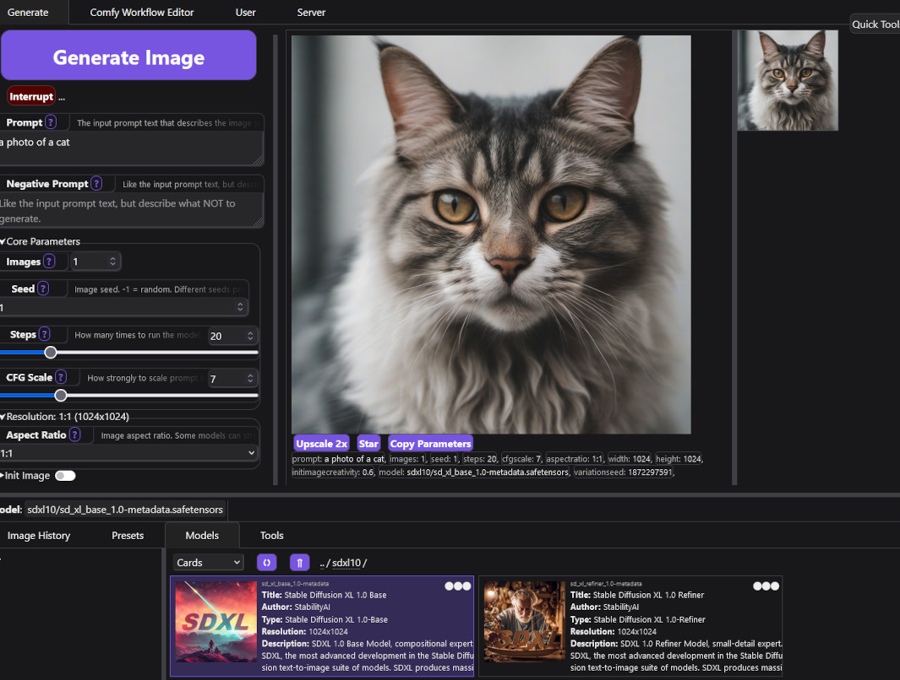

# StableSwarmUI

**StableSwarmUI 0.5.1 Alpha**.

A Modular Stable Diffusion Web-User-Interface, with an emphasis on making powertools easily accessible, high performance, and extensibility.

You can take it for a test-drive on [Google Colab](https://colab.research.google.com/github/Stability-AI/StableSwarmUI/blob/master/colab/colab-notebook.ipynb)

Follow the [Feature Announcements Thread](https://github.com/Stability-AI/StableSwarmUI/discussions/11) for updates on new features.

# Status

This project is in **ALPHA** status. That means all the basic features work, but there's a wide range of core features not yet implemented, and there are many bugs and not-too-great-quality-of-life issues throughout.

Powerusers and developers are encouraged to try it out and help build it, but general/beginner users are advised caution.

Those interested in helping push from Alpha to Beta to Full Release are welcome to submit PRs (read the [Contributing](/CONTRIBUTING.md) document first), and you can contact us here on GitHub or on [Discord](https://discord.gg/stablediffusion) in the `stableswarmui` channel. I highly recommended reaching out to ask about plans for a feature before PRing it. There may already be specific plans or even a work in progress.

Key feature targets not yet implemented:
- Image editing tools
- LoRAs, ControlNets
- Internal TIs (already supported indirectly as all compatible backends specify these via text anyway, but a listing and handler for them should be present)
- Text prompt tools (CLIP token counter, wildcards, etc) (some tools like prompt weighting already implicitly supported via backends)
- Localization / automatic translation
- LAN usage reliability
- Mobile browser formatting
- Self-contained internal mini-backend for simple usages
- Simple box grids for batches (eg 2x2 squares of images when you generate a batch of 4)
- Properly display ModelSpec usage-hint/trigger-phrase/etc. (need full detail "Current Model" display in UI, separate from the model selector - probably as a tab within the batch sidebar?)
- Backends should be self-expanding (that is: one ComfyUI backend in the interface should be able to expand to several)
- In-UI Comfy workflow Save&Load, and metadata edit (ie to reconfigure which parameters to send over or not)

# Installing on Windows

- Install [Dotnet SDK 7 from Microsoft](https://dotnet.microsoft.com/en-us/download/dotnet/7.0)
- Download [The Install-Windows.bat file](https://github.com/Stability-AI/StableSwarmUI/releases/download/0.5-Alpha/install-windows.bat), store it somewhere you want to install at (not `Program Files`), and run it.
    - It should open a command prompt and install itself.
    - If it closes without going further, try running it again, it sometimes needs to run twice. (TODO: Fix that)
    - It will place an icon on your desktop that you can use to re-launch the server at any time.
    - When the installer completes, it will automatically launch the StableSwarmUI server, and open a browser window to the install page.
    - Follow the install instructions on the page.
    - After you submit, be patient, some of the install processing take a few minutes (downloading models and etc).

(TODO): Even easier self-contained pre-installer, a `.msi` or `.exe` that provides a general install screen and lets you pick folder and all.

# Installing on Linux

- Install `git`, `python3` via your OS package manager if they are not already installed.
- Install DotNET 7 using the instructions at https://dotnet.microsoft.com/en-us/download/dotnet/7.0 (you need `dotnet-sdk-7.0`, as that includes all relevant sub-packages)
- Open a shell terminal and `cd` to a directory you want to install into
- Run shell commands:
    - `git clone https://github.com/Stability-AI/StableSwarmUI`
    - cd `StableSwarmUI`
    - `./launch-linux.sh`
- open `http://localhost:7801/Install`
- Follow the install instructions on-page.

(TODO): Maybe outlink a dedicated document with per-distro details and whatever. Maybe also make a one-click installer for Linux?

# Installing on Mac

- Install dotnet: `brew install dotnet`

(TODO): somebody with Mac experience needs to fill this in. Probably similar to Linux. See also [issue #7](https://github.com/Stability-AI/StableSwarmUI/issues/7).

# Documentation

See [the documentation folder](docs).

# Motivations

The "Swarm" name is in reference to the original key function of the UI: enabling a 'swarm' of GPUs to all generate images for the same user at once (especially for large grid generations).

This project is built with a C# backend server to maximize performance while only minimally increasing code complexity. While most ML projects tend to be written in Python, that language is simply insufficient to meet the performance goals of this project (ie to provide a very fast and responsive multi-user-ready multi-backend service), notably it lacks "true" multithreading capabilities (due to Python GIL), which was deemed strongly necessary for StableSwarmUI (it must be able to use available CPU cores while serving user requests and managing internal data to be able to respond to all requests as quickly as possible). It is also hoped that building Stable Diffusion tools in C# will enable a wider range of developers to make use of Stable Diffusion (vs being limited to the Python ecosystem).

The project was designed to be heavily modular, such that backends are fully separated from the middle-layer which is fully separated from the frontend UI, and all components are interswappable. This is to enabled extensibility and customization. For example, an extension can easily provide alternative backend generators (this project comes with several built-in, such as ComfyUI, Auto WebUI, StabilityAPI, ...) without having to edit anything else to work. The limitation of this approach is some tools may not easily be intercompatible, eg the StabilityAPI backend has only a select few limited inputs, vs the local backends that have a wider range, and so many parameters don't work with StabilityAPI.

A completely custom HTML/JS frontend was built with the goal of allowing detailed and thorough customization of the UI (as opposed to eg being locked in to the way Gradio generates things).

# Legal

This project:
- embeds a copy of [7-zip](https://7-zip.org/download.html) (LGPL).
- has the ability to auto-install [ComfyUI](https://github.com/comfyanonymous/ComfyUI) (GPL).
- has the option to use as a backend [AUTOMATIC1111/stable-diffusion-webui](https://github.com/AUTOMATIC1111/stable-diffusion-webui) (AGPL).
- can automatically install [christophschuhmann/improved-aesthetic-predictor](https://github.com/christophschuhmann/improved-aesthetic-predictor) (Apache2).
- can automatically install [yuvalkirstain/PickScore](https://github.com/yuvalkirstain/PickScore) (MIT).
- can automatically install [git-for-windows](https://git-scm.com/download/win) (GPLv2).
- embeds copies of web assets from [BootStrap](https://getbootstrap.com/) (MIT), [Select2](https://select2.org/) (MIT), [JQuery](https://jquery.com/) (MIT).
- has the option to connect to remote servers to use [the Stability.ai API](https://dreamstudio.com/api/start/) as a backend.
- supports user-built extensions which may have their own licenses or legal conditions.

Copyright (C) 2023 Stability.AI

Licensed under the PolyForm Noncommercial License 1.0.0, view [LICENSE.txt](/LICENSE.txt) for details.

(In short: personal usage is free, commercial usage is not)

This license is an initial selection, particularly for the Alpha stage of the project, that is subject to change in the future.
