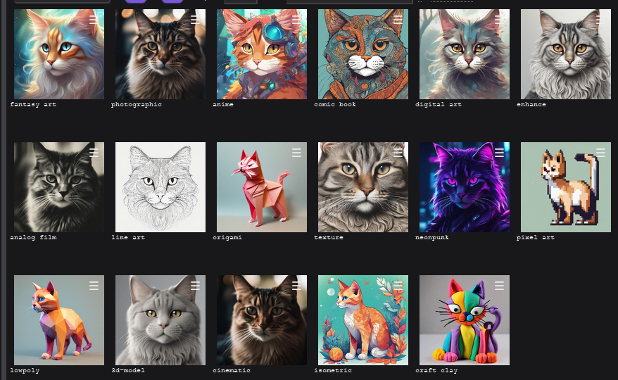

# Presets

(TODO: Info about how presets work and all that)

# Official SDXL Preset Pack

These are the presets used on DreamStudio.

- Download this file: [SDXL Official Presets.json](https://gist.githubusercontent.com/mcmonkey4eva/b63c786871e2b75cdf2622a2052620aa/raw/76be3fded8ff9b242509a50326ae4c723fd781c6/SDXL%2520Official%2520Presets.json) and save it somewhere (anywhere, desktop is fine)
- Open StableSwarmUI and open the `Presets` tab at the bottom
- Click on the `Import Presets` button
- drag the presets file in to the box that appears
- Click the `Import` button at the bottom
- close the box, look at your presets list - there is now a folder labeled `sdxlofficial` on the side. Click into that.

- You can click on any preset to use it, or unclick it to disable it.
    - (Note: if it behaves weird, refresh the page. Alpha projects do silly things sometimes!)
